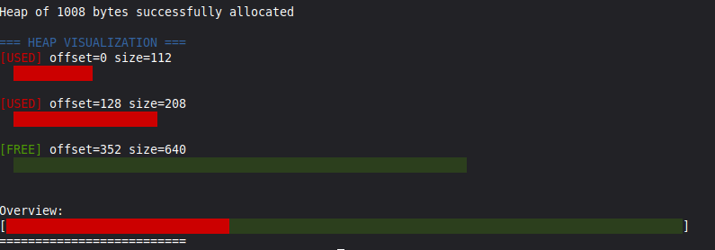

# Pocket-Allocator

A working memory allocator that manages its own heap (up to 8KB), featuring allocation, 
reallocation, and freeing with block splitting and coalescing. Includes a colorful ASCII 
visualizer to see your heap's memory layout in real-time. Ever wondered how malloc() works
under the hood? This project can help with that understanding! 

## Features

- **Two allocation strategies**: First-fit and best-fit
- **Complete memory management**: malloc, free, and realloc
- **Block splitting and coalescing**: Efficient memory reuse
- **16-byte alignment**: Industry-standard memory alignment
- **Heap integrity checker**: Validates heap structure
- **ASCII visualization**: Color-coded terminal display
- **JSON export**: For external visualization tools

## Project Structure
toy-allocator/
├── README.md 
├── images/         
└──  src/
   ├── allocator.c
   ├── allocator.h
   ├── main.c
   └── test_allocator.c

## Quick Start Guide

**Note for Windows users:** For best color visualization, use Windows Terminal, 
WSL, or MinGW with a modern terminal. The old Command Prompt may not display 
colors correctly.

1. Edit `src/main.c` to experiment with the allocator
2. In your terminal, go to the root directory of Pocket-Allocator
3. Compile and run:
```bash
gcc -o demo src/main.c src/allocator.c
./demo
```
## Example Usage

-Open src/main.c and try: 

```c
#include "allocator.h"

int main() {
    init_heap(1000);
    
    void *p1 = my_alloc_ff(100);
    void *p2 = my_alloc_ff(200);
    
    visualize_heap();  // See your allocations!
    
    my_free(p1);
    my_free(p2);
    
    return 0;
}
```
-This is what the output should look like: 



-If thats the case, everything should be working correctly!

## How it works

**A quick aside:** I am by no means an expert on this subject, in fact I am completely new
to programming, and computer science in general, so there may be some simplifications, or even 
mistakes in my explanations. These explanations are the best I could do given the knowledge I have. I will come
back and tweak things if I feel like something I've written is misleading. Feel free to contact me 
at matt181888@gmail.com if you have any suggestions, I am eager to learn. 

## Heap

What is a heap? A heap is memory allocated to you by the Operating System in order to run
your programs. This generally happens automatically when running a normal program. But in our
case, we are going to be initializing a simulated heap ourselves! 

```c
int main() {
    init_heap(1000);
    return 0;
}
```
## Memory Allocation

Now that we have a heap to work with, we can allocate, reallocate and free memory to our hearts content,
but how do those functions work under the hood? 

The traditional malloc(), in C, or new(), in C++, essentially tells the operating system : "Hey, you
know that memory you're letting me use to run my program(Heap)? Yea i want to reserve part of that.".
We are doing the exact same thing here. When you call my_alloc_ff() or my_alloc_bf(), the requested bytes 
(assuming there's enough space) will be provided from our simulated heap, and that space will be marked as "used".

```c
int main(){
    init_heap(1000);
    void *p1 = my_alloc_ff(100);
    return 0;
}
```

## Block Headers

How does our allocator know where in the heap to reserve the space we're 
asking for? It uses **block headers** and allocation algorithms.

### What's a Block Header?

Every allocated or free block of memory starts with a small header that stores:
- The size of the block
- Whether it's free or in use

For this allocator, I created a 16-byte struct to hold that data:

```c
typedef struct BlockHeader{
    size_t block_size;
    bool is_free;
} block_header_t;
```

**A note on size:** For those wondering "Wait, on a 64-bit system, a `size_t` 
is 8 bytes and a `bool` is 1 byte - that's 9, not 16!" - you're correct! 
However, CPU architecture dictates that data should be aligned at certain 
boundaries. On 64-bit systems, data is typically aligned to 16 bytes, meaning 
our 9-byte struct gets padded to 16 bytes. (I'll touch more on alignment later.)

### Memory Layout

Whenever memory is allocated on the heap, a block header precedes that data:

```
[Header: 16 bytes][Your data: N bytes][Next Header: 16 bytes][More data...]
```

The header tells the allocator everything it needs to know about that block of memory.

## Allocation Strategies (First-Fit vs Best-Fit)

I decided to create two separate allocation functions: one using a first-fit 
algorithm and another using best-fit. What are these algorithms, and why are 
they useful?

### First-Fit

The first-fit algorithm does exactly what the name implies: it iterates through 
the block headers in the heap, and uses the **first** block it finds that is 
both free and large enough to hold the requested bytes.

**Example:**

Imagine your heap looks like this:

```
[FREE: 50 bytes][USED: 100 bytes][FREE: 200 bytes][FREE: 75 bytes]
```

If you request 60 bytes with first-fit, it will:
1. Check the first block (50 bytes) - too small, skip
2. Check the second block (100 bytes) - used, skip
3. Check the third block (200 bytes) - free and big enough, **use this one!**

It stops searching as soon as it finds a suitable block.

**Advantages:**
- Fast - stops at the first match (best case: O(1), worst case: O(n))
- Simple to implement

**Disadvantages:**
- Can waste space if the first block is much larger than needed
- May cause fragmentation over time

### Best-Fit

The best-fit algorithm searches through **all** free blocks in the heap and 
chooses the smallest block that can fit the requested bytes. This minimizes 
wasted space.

**Example:**

Using the same heap from before:

```
[FREE: 50 bytes][USED: 100 bytes][FREE: 200 bytes][FREE: 75 bytes]
```


If you request 60 bytes with best-fit, it will:
1. Check the first block (50 bytes) - too small, skip
2. Check the second block (100 bytes) - used, skip
3. Check the third block (200 bytes) - free and big enough, remember this
4. Check the fourth block (75 bytes) - free and big enough, **this is smaller!**
5. Use the 75-byte block (the "best fit")

It searches the entire heap to find the tightest fit.

**Advantages:**
- Minimizes wasted space
- Better memory utilization over time
- Reduces fragmentation

**Disadvantages:**
- Slower - must search the entire heap (best case: O(n))
- Can create many tiny unusable fragments

**Which should you use?** First-fit is faster, best-fit is more space-efficient. 
For this project, you can experiment with both and see the difference!

## Block Splitting

Say you had this heap: 

```
[FREE: 50 bytes][USED: 100 bytes][FREE: 200 bytes][FREE: 75 bytes]
```


You request 60 bytes using the first-fit algorithm. As previously explained, 
you would use the 200-byte free block. So now you might be thinking: "It's 
too bad we just used 200 bytes of storage for something that only required 
60 bytes!"

But that's not what happens! Instead, the allocator **splits** the block:

```
[FREE: 50 bytes][USED: 100 bytes][FREE: 200 bytes][FREE: 75 bytes]
                                ↓
[FREE: 50 bytes][USED: 100 bytes][USED: 60 bytes][FREE: 124 bytes][FREE: 75 bytes]
```

Here's what happened:
1. The 200-byte block was split into two parts
2. The first 60 bytes (plus a 16-byte header) are now marked as USED
3. The remaining 124 bytes become a new FREE block with its own header
4. No space is wasted!

The same splitting happens with best-fit allocation too!

## Freeing & block coalescing

As most who have programmed in C know, anything you allocate on the heap must 
eventually be freed, or you have a memory leak! What does calling `free()` 
actually do?

```c
int main(){
    init_heap(1000);
    void *p1 = my_alloc_ff(100);
    void *p2 = my_alloc_ff(80);
    void *p3 = my_alloc_ff(140);
    void *p4 = my_alloc_ff(200);
    return 0;
}
```
**Remember:** Each allocation uses an additional 16 bytes for their respective headers

Given this function, our heap would now look like this: 
```
[USED: 100 bytes][USED: 80 bytes][USED: 140 bytes][USED: 200 bytes][FREE: 416 bytes]
```

### Freeing Memory

Now if we call my_free(p2): 

```c
int main(){
    init_heap(1000);
    void *p1 = my_alloc_ff(100);
    void *p2 = my_alloc_ff(80);
    void *p3 = my_alloc_ff(140);
    void *p4 = my_alloc_ff(200);

    my_free(p2);
    return 0;
}
```

The data at that location is marked as unused, and the block header is marked
as free:

```
[USED: 100 bytes][FREE: 80 bytes][USED: 140 bytes][USED: 200 bytes][FREE: 416 bytes]
```
### Coalescing

Now if we did this: 

```c
int main(){
    init_heap(1000);
    void *p1 = my_alloc_ff(100);
    void *p2 = my_alloc_ff(80);
    void *p3 = my_alloc_ff(140);
    void *p4 = my_alloc_ff(200);

    my_free(p2);
    my_free(p3);
    return 0;
}
```

Instead of having two adjacent free blocks:

```
[USED: 100 bytes][FREE: 80 bytes][FREE: 140 bytes][USED: 200 bytes][FREE: 416 bytes]
```

The two blocks coalesce(merge) into one:

```
[USED: 100 bytes][FREE: 236 bytes][USED: 200 bytes][FREE: 416 bytes]
```
The math: 80 + 16 (block header) + 140 = 236 bytes

**Why coalesce?**

    - Saves 16 bytes (one block header is eliminated)
    - Faster allocation searches (fewer blocks to check)
    - Reduces fragmentation (larger contiguous free space)

## Alignment 

Now for the elephant in the room. I've been ignoring alignment in my previous 
examples to keep things simple, but it's an important topic worthy of explanation.

### What is Alignment?

Modern CPUs read memory in chunks (often referred to as "cache lines" or "words"). 
On a 64-bit system, the CPU typically reads 8 or 16 bytes at a time.

**Example of misalignment:**

Say you have memory registers numbered 0 to 15 and your CPU reads in 8 byte chunks:

```
Memory:    [0][1][2][3][4][5][6][7][8][9][10][11][12][13][14][15]
```

You store an 8 byte object at register 3:

```
Memory:    [0][1][2][x][x][x][x][x][x][x][x][11][12][13][14][15]
                     └────────────────────┘
```              

Your value spans two cache lines, requiring **two reads**:

1. Read bytes 0-7
2. Read bytes 8-15
3. Combine them
4. Extract your value

This is 2-3x slower than a single aligned read!

### Why It Matters

Some older CPU architectures (like ARM) would actually **crash** if you attempted 
to access misaligned data. Most modern CPUs (x86/x64) allow it but with a 
significant performance penalty.

### How This Allocator Handles Alignment

To ensure optimal performance:
- Heap size is automatically rounded up to the nearest multiple of 16
- All allocations are rounded up to multiples of 16
- All reallocations maintain 16-byte alignment
- Block headers are exactly 16 bytes

This guarantees that every allocation starts at an address the CPU can access 
efficiently in a single operation.

## API Reference

### `int init_heap(size_t size)`

Initializes a heap of the specified size (up to 8KB). The size will be 
automatically rounded up to the nearest multiple of 16 bytes.

**Parameters:**
- `size` - Desired heap size in bytes (1 to 8000)

**Returns:**
- `0` on success
- `1` if size is invalid

**Example:**
```c
init_heap(1000);  // Creates a 1008-byte heap (rounded up)
```

---

### `void* my_alloc_ff(size_t size)`

Allocates `size` bytes of memory to the heap, using a first-fit algorithm.

**Parameters:**
- `size` - Desired memory in bytes

**Returns:**
- Pointer to the allocated memory on success
- `NULL` if allocation fails (heap full or invalid size)

**Example:**
```c
void* p = my_alloc_ff(100);
```

---

### `void* my_alloc_bf(size_t size)`

Allocates `size` bytes of memory to the heap, using a best-fit algorithm.

**Parameters:**
- `size` - Desired memory in bytes

**Returns:**
- Pointer to the allocated memory on success
- `NULL` if allocation fails (heap full or invalid size)

**Example:**
```c
void* p = my_alloc_bf(100);
```

---

### `void my_free(void* ptr)`

The data stored at that location is marked as free, and if possible, adjacent
free blocks coalesce. 

**Parameters:**
- `ptr` - pointer to memory on heap. 

**Returns:**
- Nothing (void)

**Example:**
```c
void* p = my_alloc_ff(100);
my_free(p);
```

---

### `void* my_realloc_ff(void* ptr, size_t new_size)`

Resizes the memory block pointed to by `ptr` to `new_size` bytes. If the new 
size is larger, attempts to expand into an adjacent free block; if not possible, 
uses first-fit to find a new location (data is copied). If smaller, shrinks the 
block and creates a new free block if more than 16 bytes remain.

**Parameters:**
- `ptr` - Pointer to previously allocated memory (or `NULL` to behave like `my_alloc_ff`)
- `new_size` - New desired allocation size (or `0` to behave like `my_free`)

**Returns:**
- Pointer to the resized memory (may be same or different address)
- `NULL` if reallocation fails

**Example:**
```c
void* p = my_alloc_ff(100);
p = my_realloc_ff(p, 200);
```
---

### `void* my_realloc_bf(void* ptr, size_t new_size)`


Resizes the memory block pointed to by `ptr` to `new_size` bytes. If the new 
size is larger, attempts to expand into an adjacent free block; if not possible, 
uses best-fit to find a new location (data is copied). If smaller, shrinks the 
block and creates a new free block if more than 16 bytes remain.

**Parameters:**
- `ptr` - Pointer to previously allocated memory (or `NULL` to behave like `my_alloc_bf`)
- `new_size` - New desired allocation size (or `0` to behave like `my_free`)

**Returns:**
- Pointer to the resized memory (may be same or different address)
- `NULL` if reallocation fails

**Example:**
```c
void* p = my_alloc_bf(100);
p = my_realloc_bf(p, 200);
```

---

### `bool check_heap_integrity()`

This is a function that checks:
- If a header is outside of heap bounds
- If there are alignment issues
- If a block extends passed the heap
- If data in a block header is corrupted

**Returns:**
- `true` if everything is okay
- `false` otherwise

**Example:**
```c
init_heap(1000);
void* p = my_alloc_ff(230);
check_heap_integrity();
```

---

### `void visualize_heap()`

Displays a color-coded ASCII visualization of the current heap state in the 
terminal. Shows each block's offset, size, and whether it's free or used, 
along with a visual bar representation and a compact overview of the entire heap.

**Returns:**
- Nothing (void)

**Example:**
```c
init_heap(1000);
void *p1 = my_alloc_ff(100);
void *p2 = my_alloc_ff(200);

visualize_heap();  // See your allocations in color!

my_free(p1);
visualize_heap();  
```

---

### `void export_heap_snapshot(const char* filename)`

Exports the current heap state to a JSON file. Useful for external visualization 
tools or debugging. The JSON contains the heap size and an array of all blocks 
with their offset, size, free status, and header size.

**Parameters:**
- `filename` - Path to the output JSON file (e.g., "heap_snapshot.json")

**Returns:**
- Nothing (void)

**Example:**
```c
init_heap(1000);
void *p1 = my_alloc_ff(100);
void *p2 = my_alloc_ff(200);

export_heap_snapshot("heap_snapshot.json");

```

## Testing

The project includes 27 comprehensive unit tests covering:
- Heap initialization and management
- Block allocation (first-fit and best-fit)
- Memory freeing and coalescing
- Reallocation (shrink, grow in place, relocate)
- 16-byte alignment verification
- Heap integrity checking
- Data preservation across operations

### Running Tests

```bash
gcc -o test_allocator src/test_allocator.c src/allocator.c
./test_allocator
```

## Future Improvements

This project was meant to be a toy allocator - not an exact replica of how a 
true allocator functions, but close enough to understand the fundamentals. 
Here's what could make it even closer to the real thing:

- Dynamic heap resizing
- Memory defragmentation
- Multi-threaded support
- More allocation algorithms (worst-fit, next-fit)
- Performance benchmarks to compare allocation strategies
- A better visualizer with animations showing splitting/coalescing in real-time

## Known Limitations

- Maximum heap size of 8KB
- Internal fragmentation on small realloc shrinks (< 16 bytes)
- No thread safety (single-threaded only)

## What I Learned

This project was awesome. Originally I wanted to better understand pointers 
and pointer arithmetic, so I asked ChatGPT for project ideas involving low-level 
coding and memory management. This idea came up and I ran with it.

### Technical Skills

I learned a lot about how memory works within a program, why pointers are so 
useful, and why pointer arithmetic can be so challenging but rewarding. I learned 
about the heap, how it works, and why it's so important for dynamic memory. I 
also learned two allocation algorithms (first-fit and best-fit) and why they're 
used despite their imperfections - there's always tradeoffs!

### Project Management

Beyond the technical skills, I learned about being clear with project goals and 
writing them down. Breaking down each goal into steps, and then into even smaller 
steps, until you have a clear path from zero to one. That was probably the most 
valuable thing I took away from this: understanding **how** to start and finish 
a project, not just the technical implementation.


